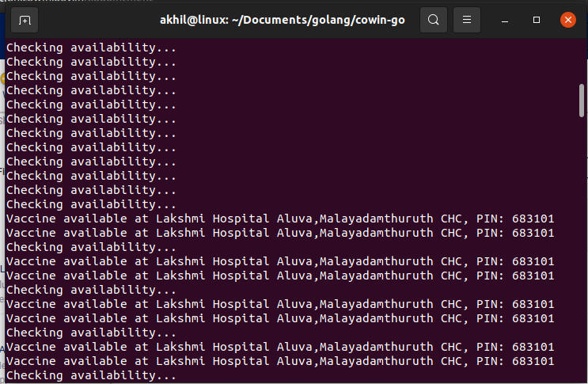

# cowin-notify-go

## A simple Go program to check vaccine availablity in locations with pincode.

* You can run the build directly which corresponds to you Operating system. OR
* If you have go runtime installed in your machine run -> go run main.go

### Screenshot

